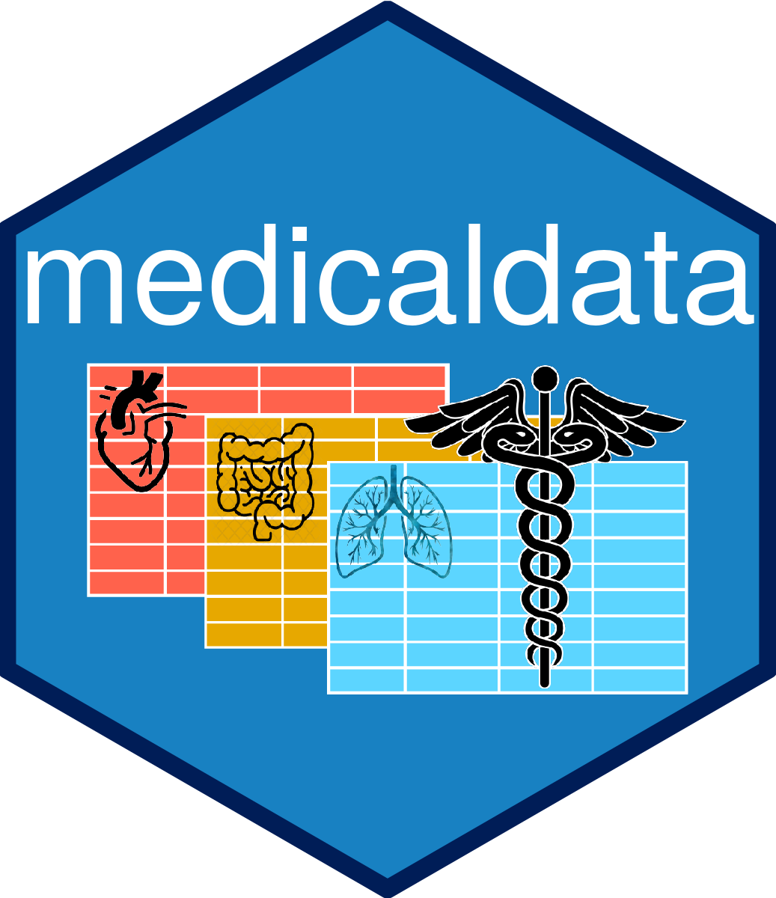

<!-- README.md is generated from README.Rmd. Please edit that file -->

# medicaldata 

## Overview

This is a data package with 15 medical datasets for teaching
Reproducible Medical Research with R. The link to the pkgdown reference
website for {medicaldata} is
[here](https://higgi13425.github.io/medicaldata/) and in the links at
the right. This package will be useful for anyone teaching R to medical
professionals, including doctors, nurses, trainees, and students.  
  These datasets range from reconstructed versions of James Lind’s
scurvy dataset (1757) and the original Streptomycin for Tuberculosis
trial (1948), a 2012 RCT of indomethacin to prevent post-ERCP
pancreatitis that I was involved in, to cohort data on SARS-CoV2 testing
results (2020). Many of the datasets come from the American Statistical
Association’s TSHS (Teaching Statistics in the Health Sciences)
[Resources Portal](https://www.causeweb.org/tshs/category/dataset/),
maintained by [Carol
Bigelow](https://www.umass.edu/sphhs/person/carol-bigelow) at the
University of Massachusetts (with permission).

## How to Install and Use {medicaldata} Datasets

1.  Install with: `remotes::install_github("higgi13425/medicaldata")`  

2.  Then load the package with `library(medicaldata)`  

3.  Then you can list the datasets available with
    `data(package = "medicaldata")`

4.  Then assign a particular dataset to a named object in your
    environment with:   `covid <- medicaldata::covid_testing`  
    where `covid` is the name of the new object, and `covid_testing` is
    the name of the dataset. 

5.  Articles (vignettes) on how to use the datasets can be found at the
    pkgdown [website](https://higgi13425.github.io/medicaldata/) under
    the **Articles** tab.

6.  You can click on the links below to view the codebook and/or
    description document for each dataset. This information is also
    available under the Reference tab above, or within R by using
    `help(dataset_name)`.  

## Please Donate Datasets

If you have access to data from a randomized, controlled clinical trial,
or a prospective cohort study, or even a case-control study, please
consider obtaining the appropriate permissions, anonymizing the data,
and donating the dataset for teaching purposes to add to this package.
Open an issue to open the discussion of a data donation.

## List of Datasets

Click on links below for more details about the dataset itself in the
Description Document, and more details about the variables included in
the dataset in the Codebook. Note that each dataset also has a help file
that you can use within R or RStudio, by entering `help("dataset_name")`
in the Console pane.

| Dataset          | Description document                                                                                                                            | Codebook                                                                                                                                          |
|:-----------------|:------------------------------------------------------------------------------------------------------------------------------------------------|:--------------------------------------------------------------------------------------------------------------------------------------------------|
| strep\_tb        | [strep\_tb\_desc](https://htmlpreview.github.io/?https://github.com/higgi13425/medicaldata/blob/master/man/description_docs/strep_tb_desc.html) | [strep\_tb\_codebook](https://htmlpreview.github.io/?https://github.com/higgi13425/medicaldata/blob/master/man/codebooks/strep_tb_codebook.html)  |
| scurvy           | [scurvy\_desc](https://htmlpreview.github.io/?https://github.com/higgi13425/medicaldata/blob/master/man/description_docs/scurvy_desc.html)      | [scurvy\_codebook](https://htmlpreview.github.io/?https://github.com/higgi13425/medicaldata/blob/master/man/codebooks/scurvy_codebook.html)       |
| indo\_rct        | [indo\_rct\_desc](https://htmlpreview.github.io/?https://github.com/higgi13425/medicaldata/blob/master/man/description_docs/indo_rct_desc.html) | [indo\_rct\_codebook](https://htmlpreview.github.io/?https://github.com/higgi13425/medicaldata/blob/master/man/codebooks/indo_rct_codebook.html)  |
| polyps           | [polyps\_desc](https://htmlpreview.github.io/?https://github.com/higgi13425/medicaldata/blob/master/man/description_docs/polyps_desc.html)      | [polyps\_codebook](https://htmlpreview.github.io/?https://github.com/higgi13425/medicaldata/blob/master/man/codebooks/polyps_codebook.html)       |
| covid\_testing   | [covid\_desc](https://htmlpreview.github.io/?https://github.com/higgi13425/medicaldata/blob/master/man/description_docs/covid_desc.html)        | [covid\_codebook](https://htmlpreview.github.io/?https://github.com/higgi13425/medicaldata/blob/master/man/codebooks/covid_testing_codebook.html) |
| blood\_storage   | [blood\_storage\_desc](https://www.causeweb.org/tshs/datasets/Blood%20Storage%20Dataset%20Introduction.pdf)                                     | [blood\_storage\_codebook](https://www.causeweb.org/tshs/datasets/Blood%20Storage%20Data%20Dictionary.pdf)                                        |
| cytomegalovirus  | [cytomegalovirus\_desc](https://www.causeweb.org/tshs/datasets/Cytomegalovirus%20Dataset%20Introduction.pdf)                                    | [cytomegalovirus\_codebook](https://www.causeweb.org/tshs/datasets/Cytomegalovirus%20Data%20Dictionary.pdf)                                       |
| esoph\_ca        | [esoph\_ca\_desc](https://htmlpreview.github.io/?https://github.com/higgi13425/medicaldata/blob/master/man/description_docs/esoph_ca_desc.html) | [esoph\_ca\_codebook](https://htmlpreview.github.io/?https://github.com/higgi13425/medicaldata/blob/master/man/codebooks/esoph_ca_codebook.html)  |
| laryngoscope     | [laryngoscope\_desc](https://www.causeweb.org/tshs/datasets/Laryngoscope%20Dataset%20Introduction.pdf)                                          | [laryngoscope\_codebook](https://www.causeweb.org/tshs/datasets/Laryngoscope%20Data%20Dictionary.pdf)                                             |
| licorice\_gargle | [licorice\_gargle\_desc](https://www.causeweb.org/tshs/datasets/Licorice%20Gargle%20Dataset%20Introduction.pdf)                                 | [licorice\_gargle\_codebook](https://www.causeweb.org/tshs/datasets/Licorice%20Gargle%20Data%20Dictionary.pdf)                                    |
| opt              | [opt\_desc](https://www.causeweb.org/tshs/datasets/OPT_Dataset_Introduction.pdf)                                                                | [opt\_codebook](https://www.causeweb.org/tshs/datasets/OPT_Data_Dictionary.pdf)                                                                   |
| smartpill        | [smartpill\_desc](https://www.causeweb.org/tshs/datasets/Smart%20Pill%20Dataset%20Introduction.pdf)                                             | [smartpill\_codebook](https://www.causeweb.org/tshs/datasets/Smart%20Pill%20Data%20Dictionary.pdf)                                                |
| supraclavicular  | [supraclavicular\_desc](https://www.causeweb.org/tshs/datasets/Supraclavicular%20Dataset%20Introduction.pdf)                                    | [supraclavicular\_codebook](https://www.causeweb.org/tshs/datasets/Supraclavicular%20Data%20Dictionary.pdf)                                       |
| indometh         | [indometh\_desc](https://htmlpreview.github.io/?https://github.com/higgi13425/medicaldata/blob/master/man/description_docs/indometh_desc.html)  | [indometh\_codebook](https://htmlpreview.github.io/?https://github.com/higgi13425/medicaldata/blob/master/man/codebooks/indometh_codebook.html)   |
| theoph           | [theoph\_desc](https://htmlpreview.github.io/?https://github.com/higgi13425/medicaldata/blob/master/man/description_docs/theoph_desc.html)      | [theoph\_codebook](https://htmlpreview.github.io/?https://github.com/higgi13425/medicaldata/blob/master/man/codebooks/theoph_codebook.html)       |

<!-- badges: start -->

<!-- badges: end -->
